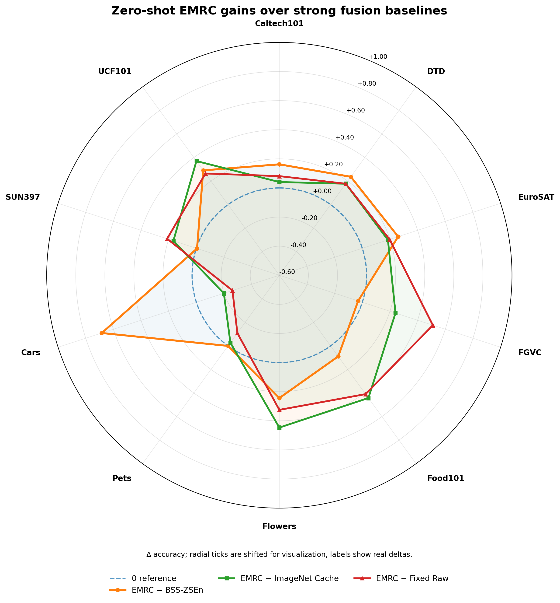
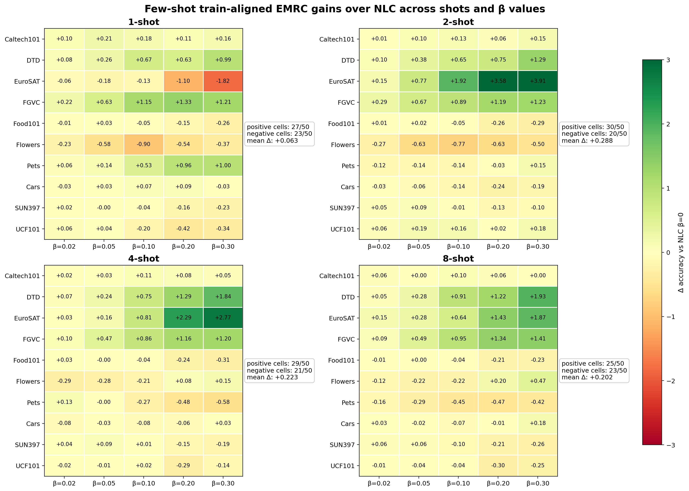

# DualBackboneFusion-EMRC

**Reliability-aware multi-backbone fusion for CLIP-style visual recognition.**

[English](#english) | [中文](#中文)

---

## English

### Overview

This repository contains a cleaned research release for **DualBackboneFusion-EMRC**. The project studies whether an external class-level backbone reliability prior can improve multi-backbone CLIP fusion.

We focus on two settings.

| Setting | Goal | Main idea |
|---|---|---|
| Zero-shot EMRC | Transfer reliability without target labels | Build an ImageNet-source reliability cache and retrieve class-level priors for target classes |
| Few-shot NLC + EMRC | Improve a learned controller | Inject EMRC as a train-aligned class-level routing prior into an NLC-style controller |

The core finding is simple: **EMRC provides class-level reliability, while NLC learns sample-level calibration. These two signals are complementary.**

---

### Method

#### Zero-shot EMRC

EMRC builds an ImageNet-source reliability cache using ImageNet logits, labels, and class text features. At target time, it only uses target class text features to retrieve reliability priors from the source cache. Target labels are not used for routing.

#### Few-shot NLC + EMRC

The NLC-style controller takes concatenated frozen CLIP image features and predicts per-backbone temperature values. We inject EMRC through a train-aligned routing objective, where `beta=0` is the NLC-equivalent baseline and `beta>0` adds the EMRC class-level routing prior.

---

### Results

#### Zero-shot EMRC

Protocol: ImageNet is used only as the source/cache dataset. The target average is computed over 10 non-ImageNet datasets and 3 seeds.

| Method | Mean accuracy |
|---|---:|
| ViT-B/16 | 58.8517 |
| BSS-ZSEn | 61.1834 |
| Fixed Raw w0.50 | 61.1958 |
| ImageNet Dataset Cache | 61.1922 |
| EMRC Conf-Gate | 61.2548 |
| **EMRC-TopK** | **61.3764** |

EMRC-TopK improves over BSS-ZSEn by **+0.1930** on average, with **7/1/2** wins/ties/losses across datasets.

Clean table: `summary_tables/zero_shot/table1_main_results_prob_emrc_clean_no_oracle.md`

#### Few-shot NLC + EMRC

Protocol: 10 datasets, 3 seeds, 1/2/4/8-shot.

| Shot | NLC β=0 | Best EMRC routing | Gain |
|---:|---:|---:|---:|
| 1-shot | 61.1334 | 61.2621 | +0.1287 |
| 2-shot | 61.0290 | 61.6108 | +0.5818 |
| 4-shot | 61.4461 | 61.9282 | +0.4822 |
| 8-shot | 61.5967 | 62.0665 | +0.4698 |

Across all tested beta values, train-aligned EMRC routing improves over the NLC-equivalent baseline on average. The heatmap reports per-dataset gains for each shot and each beta, showing that the improvement is not driven by a single dataset.

Few-shot table: `summary_tables/few_shot/summary_1_2_4_8.md`

---

### Clean audit

The release includes clean-audit notes under `summary_tables/clean_audit/`.

Current checks include:

- 1/2/4/8-shot completeness: 10 datasets × 3 seeds.
- No few-shot train/test overlap.
- Correct per-class shot count.
- Four-backbone label and class-name alignment.
- ImageNet-source cache provenance for zero-shot EMRC.
- Routing class-set alignment.
- Oracle diagnostics removed from the clean main table.
- Leave-one-dataset-out hyperparameter audit for zero-shot robustness.

---

### Repository structure

| Path | Description |
|---|---|
| `scripts/zero_shot_emrc/` | ImageNet source cache and zero-shot EMRC evaluation |
| `scripts/few_shot_nlc_emrc/` | NLC-style controller and train-aligned EMRC routing |
| `scripts/utils/` | Plotting and helper scripts |
| `figures/` | README figures |
| `summary_tables/zero_shot/` | Clean zero-shot results |
| `summary_tables/few_shot/` | Few-shot NLC + EMRC results |
| `summary_tables/clean_audit/` | Clean-audit notes |
| `outputs/` | Lightweight manifests, priors, routing metadata, and raw few-shot CSVs |

Large datasets, logits, image features, and checkpoints are not included.

---

### Reproducibility note

This is a cleaned research release, not yet a fully plug-and-play benchmark package. To reproduce the full pipeline from scratch, generate four-backbone CLIP logits/features first, then run the zero-shot EMRC and few-shot NLC+EMRC scripts.

---

## 中文

### 项目简介

本仓库是 **DualBackboneFusion-EMRC** 的 clean research release。项目研究 CLIP 多视觉主干融合中，外部类别级 backbone reliability prior 是否能够提升融合效果。

我们整理了两条主线。

| 设置 | 目标 | 核心思路 |
|---|---|---|
| Zero-shot EMRC | 不使用 target labels 进行可靠性迁移 | 用 ImageNet 构建 source reliability cache，再为 target classes 检索类别级先验 |
| Few-shot NLC + EMRC | 增强 learned controller | 将 EMRC 作为 train-aligned class-level routing prior 注入 NLC-style controller |

核心结论：**EMRC 提供类别级可靠性，NLC 学习样本级 temperature calibration，二者互补。**

---

### 方法

#### Zero-shot EMRC

EMRC 使用 ImageNet logits、labels 和类别文本特征构建 source reliability cache。目标数据集阶段只使用 target class text features 检索 reliability prior，不使用 target labels 参与 routing。

#### Few-shot NLC + EMRC

NLC-style controller 输入多个 frozen CLIP backbone 的 image features，输出每个 backbone 的 temperature。我们通过 train-aligned routing objective 注入 EMRC，其中 `beta=0` 等价于 NLC baseline，`beta>0` 表示加入 EMRC 类别级 routing prior。

---

### 主要结果

#### Zero-shot EMRC

协议：ImageNet 只作为 source/cache dataset；target average 使用 10 个非 ImageNet 数据集和 3 个 seeds。

| 方法 | 平均准确率 |
|---|---:|
| ViT-B/16 | 58.8517 |
| BSS-ZSEn | 61.1834 |
| Fixed Raw w0.50 | 61.1958 |
| ImageNet Dataset Cache | 61.1922 |
| EMRC Conf-Gate | 61.2548 |
| **EMRC-TopK** | **61.3764** |

EMRC-TopK 相比 BSS-ZSEn 平均提升 **+0.1930**，wins/ties/losses 为 **7/1/2**。

主表：`summary_tables/zero_shot/table1_main_results_prob_emrc_clean_no_oracle.md`

#### Few-shot NLC + EMRC

协议：10 个数据集，3 个 seeds，1/2/4/8-shot。

| Shot | NLC β=0 | 最优 EMRC routing | 提升 |
|---:|---:|---:|---:|
| 1-shot | 61.1334 | 61.2621 | +0.1287 |
| 2-shot | 61.0290 | 61.6108 | +0.5818 |
| 4-shot | 61.4461 | 61.9282 | +0.4822 |
| 8-shot | 61.5967 | 62.0665 | +0.4698 |

所有测试 beta 的平均结果都高于 NLC-equivalent beta=0 baseline。

Few-shot 表格：`summary_tables/few_shot/summary_1_2_4_8.md`

---

### Clean audit

clean audit 文件位于 `summary_tables/clean_audit/`。

当前已检查：

- 1/2/4/8-shot 完整性：10 datasets × 3 seeds。
- few-shot train/test 无重叠。
- 每类 shot count 正确。
- 四个 backbone 的 label 和 class name 对齐。
- zero-shot EMRC 的 ImageNet-source cache provenance。
- routing class-set 对齐。
- oracle diagnostic 已从 clean 主表移除。
- zero-shot leave-one-dataset-out 超参稳健性检查。

---

### 仓库结构

| 路径 | 内容 |
|---|---|
| `scripts/zero_shot_emrc/` | ImageNet source cache 与 zero-shot EMRC 评估 |
| `scripts/few_shot_nlc_emrc/` | NLC-style controller 与 train-aligned EMRC routing |
| `scripts/utils/` | 画图与辅助脚本 |
| `figures/` | README 图片 |
| `summary_tables/zero_shot/` | clean zero-shot 结果 |
| `summary_tables/few_shot/` | few-shot NLC + EMRC 结果 |
| `summary_tables/clean_audit/` | clean audit 记录 |
| `outputs/` | 轻量 manifest、prior、routing metadata 和 few-shot raw CSV |

大规模 datasets、logits、image features 和 checkpoints 不包含在仓库中。

---

### 复现说明

这是 clean research release，不是完整一键复现 benchmark 包。完整复现需要先生成四个 CLIP backbone 的 logits/features，再运行 zero-shot EMRC 和 few-shot NLC+EMRC 脚本。
